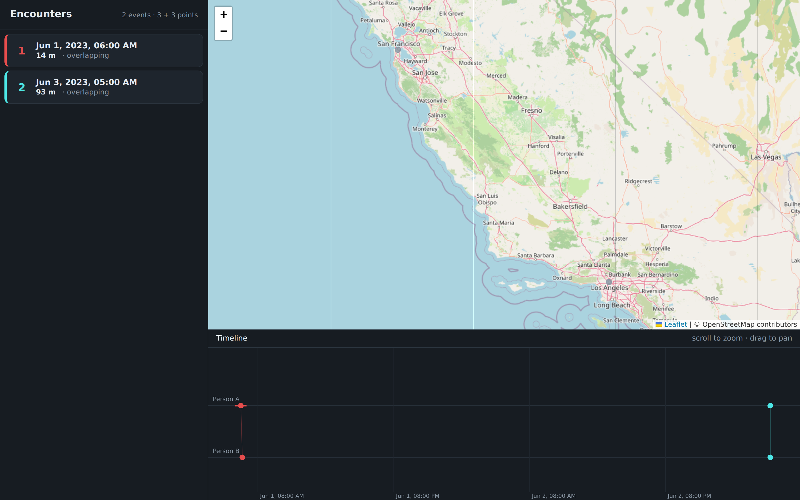
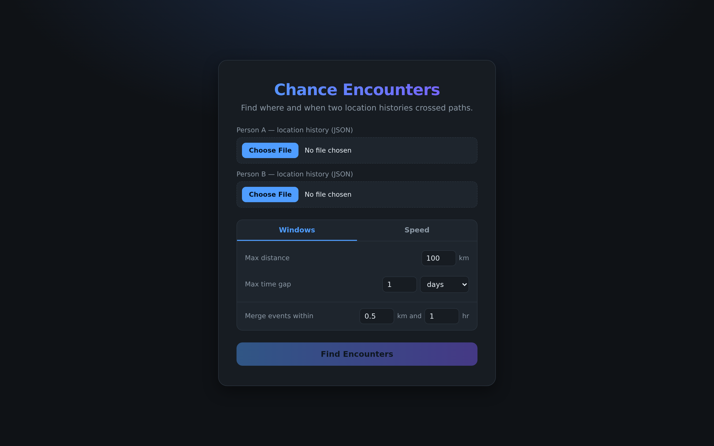

# Chance Encounters

Compare two people's Google Location History to find the moments in time and space where
they unknowingly were near each other.

Live at <https://ekatiyar.github.io/chance-encounters/>

It's a static page, and your location history files are read in the browser and never uploaded anywhere.





## Getting your data

Google moved Timeline export off the web. In the Google Maps app, open your profile
picture, then Timeline, then the three-dot menu, then "Export Timeline data". You get a
single JSON file.

Older Takeout exports still work. The parser accepts three shapes:

- A top-level array of timeline entries, which is what the phone export produces
- `{"timelineObjects": [...]}`, the Semantic Location History monthly files such as `2023_JANUARY.json`
- `{"locations": [...]}`, the classic `Records.json`

## Tuning the search

Two modes decide what counts as an encounter.

**Windows** takes a max distance and a max time gap. Two points match when they fall
inside both.

**Speed** replaces the fixed distance with an assumed travel speed, then asks whether the
two people could have reached each other in the gap between their pings.

"Merge events within" collapses nearby hits into one encounter for quicker computation.

## Development

### Prerequisites

- [Rust](https://www.rust-lang.org/tools/install)
- [wasm-pack](https://rustwasm.github.io/wasm-pack/) (`cargo install wasm-pack`)
- [cargo-make](https://github.com/sagiegurari/cargo-make) (`cargo install cargo-make`)
- Python 3, for the local preview server

### Steps

1. **Add wasm as a rustup target**

   ```sh
   rustup target add wasm32-unknown-unknown
   ```

2. **Run the tests**

   ```sh
   cargo test
   ```

3. **Build the static site**

   ```sh
   cargo make build
   ```

   wasm-pack compiles the Rust core into `release/pkg/`, then the task copies
   `index.html`, `styles.css`, `main.js`, and `worker.js` alongside it.

4. **Preview locally**

   ```sh
   cargo make serve
   ```

   Then open <http://localhost:8080>. Opening `release/index.html` directly as a `file://`
   URL will not work, because the Web Worker and wasm both need HTTP.

### cargo make tasks

| Task | What it does |
| --- | --- |
| `cargo make build` | Compile the wasm module and assemble `release/` |
| `cargo make serve` | Serve `release/` at localhost:8080 |
| `cargo make test` | Run the Rust test suite |
| `cargo make update-pages` | Publish `release/` to the `gh-pages` branch |
